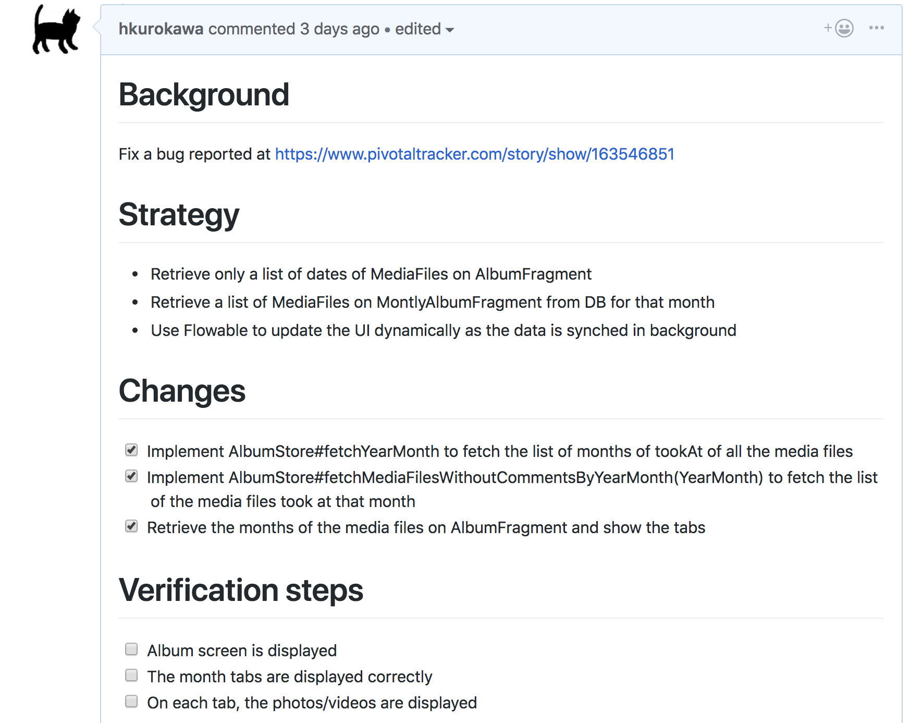
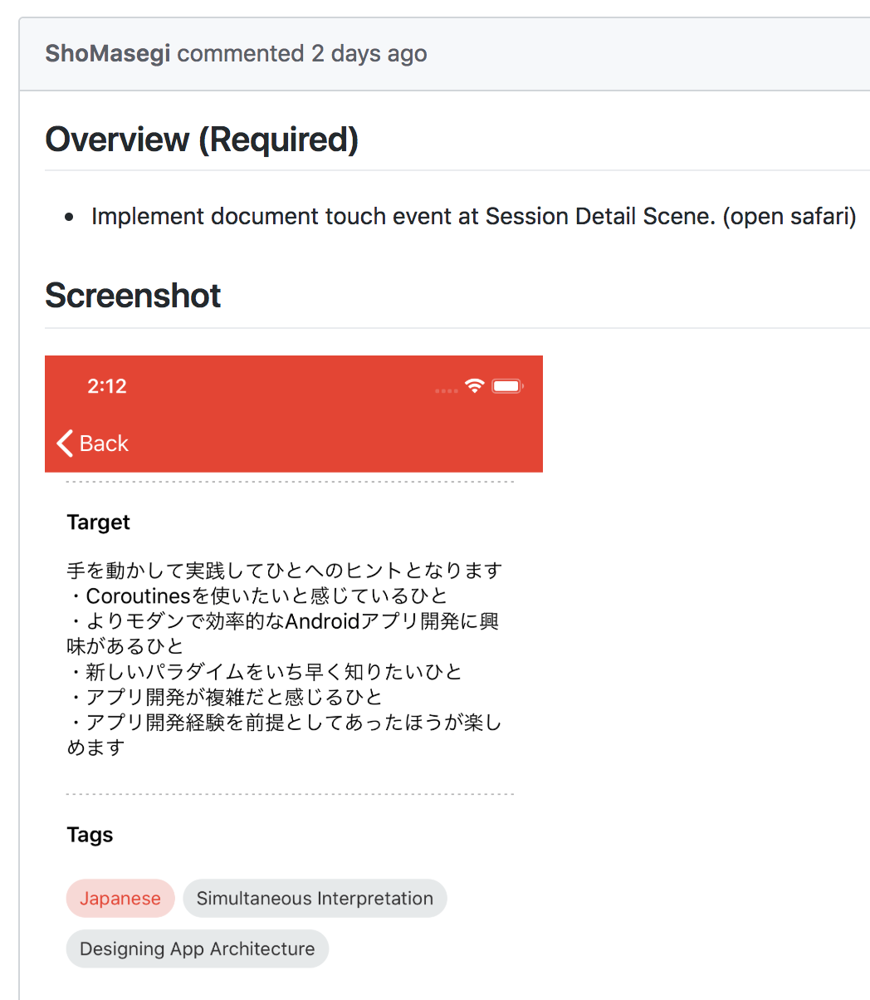
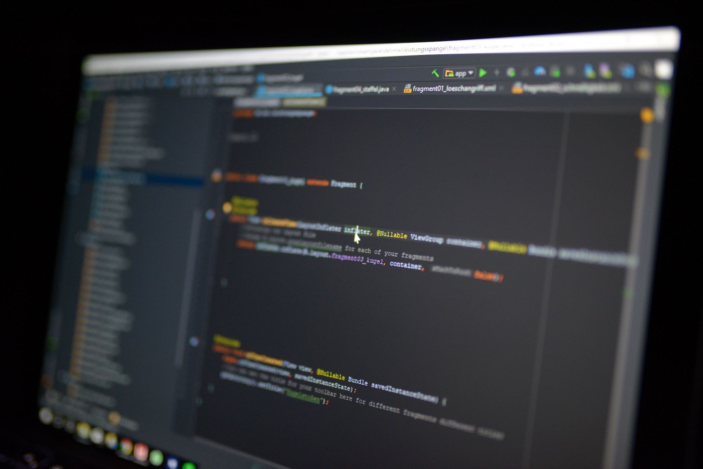
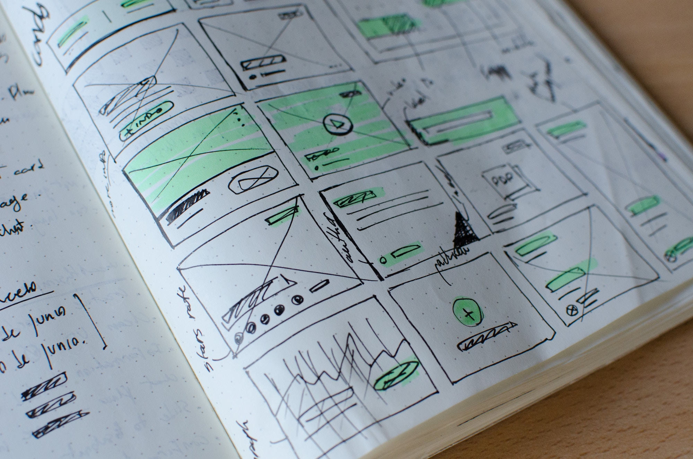
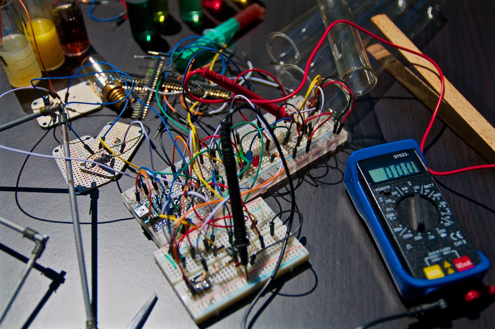

# Code Review as a Collaborative Journey

[.footer: Hiroshi Kurokawa, Takafumi Nanao, mixi, Inc., DroidKaigi 2019]

^
Hi, good morning everyone.
I am Hiroshi Kurokawa and (Nanao-san says his name). Today we are giving a talk about code review.
Is anyone doing code review?  Raise your hand if you are doing code review as a part of your daily job.
Thank you.
We are doing code review probably several times everyday.  And, of course, our code is reviewed by peers as well.
It is so common in the development process that we sometimes think we know well about code review.
But I noticed there are good reviews and not-good ones.
Some reviewers give considerate good feedback to a peer and they could have great dicussion to make the product better while others just point out some typos.
I think there are some techniques on how to do a good code review.  In terms of Android app development, there are some tips and tricks to do efficient code review as well.
Today we would like to share that.

---

# What is Code Review For?

^
Before talking about code review.  I would like to give a brief definition about code review.  Especially about what it is done for.
Code review has many aspects and when I just say "code review", you might have a different perception than me.
Someone might think it is for finding out a bug while others might think it is for discussing specifications.

---
# What is Code Review NOT For?
- Finding out a programming bug 🕵️
- Code formatting, linting ♻️
- Discussing the specification 👷

^
To clarify what the code review is, I am listing up what the code review is NOT for so that you could get a clearer image about code review.
First, it is not for finding out a bug.
Of course, sometimes the reviewer could find a potential bug and that is great.
But it is not the goal of the code review.  It is mostly done through testing.
Second, there are many formatting rules or lint warnings.  And it is also good to point out such things - which will anyway make the code better.
But I think it is job of formatter or linter.
Finally, the code review is not for discussing the specification of a product.
It is always useful to talk about the specification.  And even when the specification is fixed before a developer starts coding, everything might not work as planned.
In such cases, we need to have a discussion around the spcification and fix it.
Here what I want to say is if you feel the spcification has a problem, involve the product manager and discuss it offline not on GitHub.

[.build-lists: true]
---
## Code Review is for Collaboration
- Sharing knowledge 📖
- Sharing skill 🔧
- Making a good product through discussion 🗯

^
So, what code review is for?
In my opinion, it is for sharing knowledge, sharing skills and making a good product.  In short, it is for collaboration.
The first part of the process is to embrace how the reviewee thinks and solves a problem.
At first, you have no idea why the reviewee does this thing or that thing.
But through the code review, you may have a kind of heart-to-heart exchanges with the reviewee and finally get his or her idea.
And then you could give a feedback or a suggestion on how to improve their code.  This is the latter part of code review.
The reason why I use the word "journey" in the title of this talk is because this process looks like a journey.
Not a physical one but rather a psychological one.
You walk down the way with the reviewee, have a conversation discussing scenary.
You will try to understand what he or she thinks about it and why they choose this route but not that route.
Sometimes you might find a better route or you might be told what you would overlook without the fellowship.
At last you and your reviewee get to the goal.
Until then, you would have gained a deeper understanding on the problem you are solving and I am sure it will make your product better.
This is the purpose of code review.  Collaborating with your coworker to make a good product.

[.build-lists: true]

---
# What Information is required for Code Review?
- Goal
- Background
- Strategy
- Changes made
- Verification steps

^
To go on this journey, you need some information.
First of all, the goal is most important.  What is the problem the Pull Request tries to solve?  For what do we have to change our code?
And, next, there must be a background behind the change.  Sometimes its a disucssion in person or a chat on Slack.
Anyway, there is a context for this change and doing code review without knowing that background is like going through a tunnel without a light.
Next, if the Pull Request is rather large, take strategy into consideration.  How does your reviewee tackle the problem?
Just adding a patch to the existing code or trying to refactor a component to make the change easier?
Is he or she building up a custom view or adding a small modification on an existing one?
You should keep in mind the overall strategy of the change.
And if you have any questions or concerns about it, ask the reviewee then.
The sooner the feedback is, the better for the reviewee to fix his or her change.
And, of course, you have a list of changes included in the Pull Request.
That might be just a sequence of commits or, if the reviewee is experienced, they might give you a list of brief description about what they have made.
Lastly, although not so many people add this information to their Pull Request, it would be great to know how to verify if the change is correct.
I mean, how you can be sure that the change solves the problem and does not cause any bad side effects - regression bugs.

[.build-lists: true]

---
# Pull Request Template



^
Just for your reference, here is a template I am using for Pull Request.
I am always asking people to fill out this template when submitting a Pull Request.
Then you can easily get the summary of the changes required for you to review.

---


[.footer: Photo by [Annie Spratt](https://unsplash.com/photos/p1bHqLjKwi4?utm_source=unsplash&utm_medium=referral&utm_content=creditCopyText) on [Unsplash](https://unsplash.com/search/photos/story-book?utm_source=unsplash&utm_medium=referral&utm_content=creditCopyText)]

# The Story of Code Review

^
OK.  Let's take a look at a typical code review process.  And, here, I am using an analogy for the code review process - a journey.
Code review is like a journey.  You are handed over a map with a route on it, a Pull Request, and you walk down to the goal following the route and see how good the route is, I mean, verify how good the code is.

---


[.footer: Photo by [Christopher Burns](https://unsplash.com/photos/-jbsw_GUK74?utm_source=unsplash&utm_medium=referral&utm_content=creditCopyText) on [Unsplash](https://unsplash.com/search/photos/journey?utm_source=unsplash&utm_medium=referral&utm_content=creditCopyText)]

# 1. Understand the Background and the Goal

^
When you have a map, what do you do first?  Yes, find the goal.
And do not forget asking about the background as I mentioned earlier.
Why do I have to get there?  What problem do I want to solve?
If you start walking without knowing what the problem is, I am sure you cannot tell whether the route is good or bad.
If you have any questions about them, ask the reviewee.  The sooner, the better.

---


[.footer: Photo by [Annie Spratt](https://unsplash.com/photos/qyAka7W5uMY?utm_source=unsplash&utm_medium=referral&utm_content=creditCopyText) on [Unsplash](https://unsplash.com/search/photos/journey?utm_source=unsplash&utm_medium=referral&utm_content=creditCopyText)]

# 2. Go through the Strategy and What was Made

^
OK.  Now I am ready to go on a trip!  Let's start!  No, no.  A well experienced traveller examines the route before starting his or her journey.
Of course, you do not need to check the details.  But it is valuable to have a rough idea on how the route is.  For example, does the route avoid a mountain in clockwise or counter-clockwise?
Or does the route follow the shortest but hard path or longer but easy path?
If the Pull Request you are reviewing describes some concerns, check them at this time.  You might be able to advise something on them here.
For example, I once reviewed a Pull Request and noticed a standard widget can be used with a few modification instead of building a custom widget from scratch.
I gave that feedback to the reviewee and we agreed that it would be better solution.  Although he had to remove most part of his code, we did not need to waste time on the custom widgets to be removed at last.
So read the strategy and the list of changes and give a feedback to the reviewee if necessary.

---


[.footer: Photo by [delfi de la Rua](https://unsplash.com/photos/OrCvp6dFrKc?utm_source=unsplash&utm_medium=referral&utm_content=creditCopyText) on [Unsplash](https://unsplash.com/search/photos/journey?utm_source=unsplash&utm_medium=referral&utm_content=creditCopyText)]

# 3. Verify if the Change Really Takes You to the Goal

^
Now you can start walking. And here is my advice.
Drive a car to the goal instead of walking with your two legs.
Just joking. But please note it is really easy to check whether the code *works* or not.
Just compile and run the app to see how it works.
This is why having the verification steps in the Pull Request is helpful.
I have many experiences that the code just does not compile when Proguard is enabled, or the app crashes instantly on a device I am using.
So make sure the code at least runs before reviewing each changes in detail.
In addition to that, seeing the actual running app may give you some inspirations, such as what if the network is offline?  What if the activity is destroyed?
If you review the change while keeping these kind of points in mind, it would make your review more thoughtful.

---


[.footer: Photo by [Caleb Jones](https://unsplash.com/photos/J3JMyXWQHXU?utm_source=unsplash&utm_medium=referral&utm_content=creditCopyText) on [Unsplash](https://unsplash.com/search/photos/journey?utm_source=unsplash&utm_medium=referral&utm_content=creditCopyText)]

# 4. Look into Every Changes One by One

^
Now is the time to look into changes in detail.
I am not describing the techniques about how to review each changes.
That part will be done later in this talk.
One thing to note is that the rule of thumb is to think and feel as the reviewee does.
As a proverb says, walk in his moccasins.
You already know the background, the goal and the strategy of the journey.
This means you are more likely to be able to understand why each change is made and why he or she takes this option not others.
This is the very heart of the code review.  Thorough this process, you could share knowledge and skill with the reviewee more efficiently.

---


[.footer: Photo by [Vlad Bagacian](https://unsplash.com/photos/d1eaoAabeXs?utm_source=unsplash&utm_medium=referral&utm_content=creditCopyText) on [Unsplash](https://unsplash.com/search/photos/journey?utm_source=unsplash&utm_medium=referral&utm_content=creditCopyText)]

# 5. Look Back on the Change from the Goal

^
Now you have finished the code review and reached the goal.  Is your job done?
Wait a moment.  Do not jump the gun.
It is time to look back on your review.  When you look back on your journey from the goal, then it might look different.
In the begining of the code review, a change sometimes seem odd.  You do not get why the reviewee does that change.
But placing it in the entire journey, it might get another meaning.
So if you find one of your comments is off the point, do not hesitate to take it back.
And note if you find a change is awesome, just say that.
Review is not just pointing out a concern or a potential bug.
If you feel it is good, just express that.

---


[.footer: Photo by [rawpixel](https://unsplash.com/photos/lRssALOk1fU?utm_source=unsplash&utm_medium=referral&utm_content=creditCopyText) on [Unsplash](https://unsplash.com/search/photos/journey?utm_source=unsplash&utm_medium=referral&utm_content=creditCopyText)]

# 6. Have a Conversation with the Reviewee

^
OK.  Now your review is finally done.
Lastly, give your feed back to the reviewee and have a discussion on that.
After walking through the route with his or her moccasins, it is rather easy to have an efficient communication with the reviewee.
You know his or her pain, why, how and what he or she has made.  This is the collaboration.
Hope you guys now have a better idea on how to collaborate with the reviewee to make the code review journey more efficient and help you do a good review.
The first part of the talk is done.
Now I will switch to Nanao-san.

---


1. Understand the Background and the Goal
1. Go through the strategy and what was made
1. Verify if the change really takes you to the goal
1. Look into every changes one by one
1. Look back on the change from the goal
1. Have a conversation with the reviewee


[.footer: Photo by [Annie Spratt](https://unsplash.com/photos/qyAka7W5uMY?utm_source=unsplash&utm_medium=referral&utm_content=creditCopyText) on [Unsplash](https://unsplash.com/search/photos/journey?utm_source=unsplash&utm_medium=referral&utm_content=creditCopyText)]

^
So I'm gonna dig a little deeper into each process from 1

---


1. **Understand the Background and the Goal**

^
First process is understanding the background and the goal.

---



# Understanding the background

- Read the description
- Are enough details written to review it or is it using pull request template?

^
1. First of all, let's check if the content was written using the template.
2. If reviewee doesn't use template or there is something you don't understand, don't hesitate to ask reviewee it.
Someone may feel it's too bother to write details using the template,
but it's very helpful for the reviewer because the reviewer can feel free to review it with detail informations.
On another note,  we recently check pull requests left not reviewed in the stand-up meeting every morning,
also that's good to reduce pull requests not reviwed.

[.build-lists: true]

---


1. Understand the Background and the Goal
1. **Go through the strategy and what was made**

^
Next proccess.Check the strategy and what was made.

---


# Strategy

- organize information
- review the strategy

[.footer: Photo by [Jamie Street](https://unsplash.com/photos/dQLgop4tnsc?utm_source=unsplash&utm_medium=referral&utm_content=creditCopyText) on [Unsplash](https://unsplash.com/)]

^
After you read the description and understand the goal,
please think about if the solution which the reviewee choosed is correct.
If you feel it's weird, it's good to ask the reviewee why she or he choosed the strategy.
You may find a hidden background.

---


1. Understand the Background and the Goal
1. Go through the strategy and what was made
1. **Verify if the change really takes you to the goal**

^
If you agree with the strategy or approach to the goal,
let's run it actually following verification steps in the description.

---

# Operational check

Checkout the branch and build it locally.
The `git worktree` command is very useful.

```
git worktree add ~/code-review/branch_name branch_name
android-studio.sh ~/code-review/branch_name
```

^
To avoid wasting time, we usually do operational check before code review.
Sometimes gradle builds fail after checking out a branch which has changes about databinding, build.gradle.
So we use the git worktree command.
The worktree command enables check out the branch on another directory.
Using a different directory helps make the build stable.

---


# Build

- Warnings in build log or logcat
- Try proguard build or release build when relevant file was changed

[.footer: Photo by [Randy Fath](https://unsplash.com/photos/ymf4_9Y9S_A?utm_source=unsplash&utm_medium=referral&utm_content=creditCopyText) on [Unsplash](https://unsplash.com/)]

^
After adding worktree, let's build the app.
1. Then have a look at build log and logcat.
Changes related to build setting makes sometimes big issue.
Keep in mind to find troublesome problems as early as possible.
2. Proguard too.
If there are changes about proguard rules or build variants, try build with corresponding build variants too.

[.build-lists: true]

---


1. Understand the Background and the Goal
1. Go through the strategy and what was made
1. Verify if the change really takes you to the goal
1. **Look into every changes one by one**

^
Next process, let's look into every changes one by one.
Check how the app works.

---


# UI

- Is it along the guidelines of Material Design or your team's?
  - Is it not like iOS UI?
- Is it using animation properly?
  - Change animation scale
- Does scrolling views work smoothly?

[.footer: Photo by [rawpixel](https://unsplash.com/photos/CBFVbE7OKoU?utm_source=unsplash&utm_medium=referral&utm_content=creditCopyText) on [Unsplash](https://unsplash.com/)]


^
1.If there are changes about UI, check the UI with caution.
1-2.Unfortunately everyone is not always familiar with Material Design or Android friendly UI.
So we need to check if it's done the Android way.
2.If you want to watch the animation carefully,
2-2.the "Change animation scale" in developer options is helpful.
3. If the change is about recycler view or list of images,
check if those are reuse objects, or using cache properly.

[.build-lists: true]

---


# UI behind UI

- Is it handling errors?
- Does it work even with no data?
  - add debug code directly
  - Airplane mode

[.footer: Photo by [Mikhail Vasilyev](https://unsplash.com/photos/NodtnCsLdTE?utm_source=unsplash&utm_medium=referral&utm_content=creditCopyText) on [Unsplash](https://unsplash.com/)]


^
Next topic is more troublesome.
1,2.Only showing data is not everything.
We should handle various errors or empty state.
Check how it works, when the response from API was unexpected.
2-2.To check handling errors,
we may need to add some changes
or use some settings of emulator to debug like Airplane mode.
Even if the data is displaied normally, we should check if those handling works.

[.build-lists: true]

---


# Lifecycle

- Does it work after returning from another screen?
- Does it work after screen rotation?
- Does it work after the process was killed?
- Does it manage the Disposable or Closable at the right timing
- Can it handle buttons being tapped very fast?


[.footer: Photo by [Robert Anasch](https://unsplash.com/photos/ZFYg5jTvB4A?utm_source=unsplash&utm_medium=referral&utm_content=creditCopyText) on [Unsplash](https://unsplash.com/)]

^
This is the biggest and unavoidable topics.
We need to check a lot of things.
1.check the state with onPuause and onResume,
2.onStop and onStart,
3.onDestroy and onCreate
4.Pay attention to subscription or database objects
5.and state of Fragment or Activity too
Anyway, imagine what you don't want users to do. Just do it.

[.build-lists: true]

---


# Performance

- Is working fast? 1s is slow.
- Does it save battery?
- Doesn't any crash happen?

[.footer: Photo by [Jonathan Chng](https://unsplash.com/@jon_chng) on [Unsplash](https://unsplash.com/)]

^
1,2,3. Working fast, saving battery and no crashes are very important things for users.
Take care of dealing with complex data or background proccess.
If you feel it's slow, you should measure the time to interactive.

[.build-lists: true]

---

# Read code

- use Android Studio
- If you have question, don't hesitate to check actual operation.
- Is there any newly unnecessary code by that change.

[.footer: Photo by [Maximilian Weisbecker](https://unsplash.com/photos/1td5Iq5IvNc?utm_source=unsplash&utm_medium=referral&utm_content=creditCopyText) on [Unsplash](https://unsplash.com/)]


^
Finally, let's read the code!
1.First, it's obvious thing. Use Android Studio, so that we can read relavant code too.
2.Second, is obvious as first one.
3.Last one is a little difficult to practice.
codes which became unnecessary with changes are not easy to find.

[.build-lists: true]

---


# Layout

- unnecessary stuffs
- unnecessary nest
- deprecated components

[.footer: Photo by [Jose Alejandro Cuffia](https://unsplash.com/photos/_4815u_ACqQ?utm_source=unsplash&utm_medium=referral&utm_content=creditCopyText) on [Unsplash](https://unsplash.com/)]

^
Reviewing layout xml is painful.
But we had better watch layout carefully,
1&2. because sometimes unnecessary stuff is left after changing.
If you have any concern, change code and check how it works.
3. If you find deprecated layout components like PercentLayout,
think about replace them, or  create an issue for that.

---


# Code format

- share your coding rules
  - formatting
  - rules of lint

```
# .gitignore
!.idea/codeStyles
!.idea/inspectionProfiles
```

[.footer: Photo by [Fabio Santaniello Bruun](https://unsplash.com/photos/Y6tGu-OH8lA?utm_source=unsplash&utm_medium=referral&utm_content=creditCopyText) on [Unsplash](https://unsplash.com/)]

Photo by Fabio Santaniello Bruun on Unsplash

^
Discussing code format makes us exhausted.
We had better share settings about coding style or code inspection in repository.
Save your time with automation.
Adding those settings to `gitignore` as below is helpful.

---

# 3rd party libraries

- Is it trustworthy?
- Is it maintained well?
- Are there better alternatives?

[.footer: Photo by [Glen Noble](https://unsplash.com/photos/o4-YyGi5JBc?utm_source=unsplash&utm_medium=referral&utm_content=creditCopyText) on [Unsplash](https://unsplash.com/)]

Photo by Glen Noble on Unsplash

^
1. When new library is added, check if it's trustworthy,
2. maintained well
3. and there are better alternatives.
Even if you don't know the new library,
read the document and source code.
Then you may find better methods or classes.

[.build-lists: true]

---

# Leaks

- Use it watching the profiler of AS
- Does it have a strong reference to Activity?

[.footer: Photo by [Luis Tosta](https://unsplash.com/photos/SVeCm5KF_ho?utm_source=unsplash&utm_medium=referral&utm_content=creditCopyText) on [Unsplash](https://unsplash.com/)]

^
Also next topic is big one.
We don't have to be always sensitive about memory leak.
1.But it's good have a look profiler, when you have any concern.
2.For example, strong reference to Activity, forgetting close Closable
When you repeat screen transition,
memory usage may increase.
that's the leak

---

# Tests

- Are proper tests added?
- Are tests enough for additional conditions or boundary values?

[.footer: Photo by [Nicolas Thomas](https://unsplash.com/photos/3GZi6OpSDcY?utm_source=unsplash&utm_medium=referral&utm_content=creditCopyText) on [Unsplash](https://unsplash.com/)]

^
Since it's often hard to add tests later,
we had better write tests as ealy as possible.

---

# Side effects

- Adding Permission
- Moving Application class

[.footer: Photo by [rawpixel](https://unsplash.com/photos/K1PGQK2coPM?utm_source=unsplash&utm_medium=referral&utm_content=creditCopyText) on [Unsplash](https://unsplash.com/)]

^
1.If you add new Dangerous permission to the AndroidManifest,
auto update will be disabled.
So check if it's really necessary permission.
2.And second one is an actual failure which I made.
When I changed package name of Application class as a part of refactoring,
do you know what happened?
Users couldn't launch app from shortcut on their home screen,
because the entity of shortcut is like a bookmark which refers to the intent of former package name of application.

[.build-lists: true]

---


1. Understand the Background and the Goal
1. Go through the strategy and what was made
1. Verify if the change really takes you to the goal
1. Look into every changes one by one
1. **Look back on the change from the goal**

^

---

# Look back

- Check if your opinion or recognition is right.
- Imagine what you would  do if you were the reviewee.

^
In the end of code reading, you may have different impression from the begining.
Let's organize your thoughts to give your feedback.
Don't forget to priolitize each issue.
It makes easier to talk about issues.

---


1. Understand the Background and the Goal
1. Go through the strategy and what was made
1. Verify if the change really takes you to the goal
1. Look into every changes one by one
1. Look back on the change from the goal
1. **Have a conversation with the reviewee**

^

---

# Values

We should share common values in our team.

- Easy to read and change
- Proper package name

[.footer: Photo by [Lina Trochez](https://unsplash.com/photos/ktPKyUs3Qjs?utm_source=unsplash&utm_medium=referral&utm_content=creditCopyText) on [Unsplash](https://unsplash.com/)]

^
This topic is abstract.
Before discussing about code, we should share common values in our team.
Regarding coding rule or architecture, What is valueable thing in your team?
1.In our team, elegance of architecture doesn't matter.
Easy and simple way is the best way.
Because releases of Android platform or libraries which we use are very frequent.
We need to update them as early as possible.
So we focus on how is it easy to change, fix or add new features.
2.To develop faster, also package names should be proper.
This is off topic, but many Japanese programmers are not good at English,
not only package names, naming is actually one of the most difficult process in programming in Japan.

[.build-lists: true]

---


# Give your feedback

- Feedback details to improve the code
  - Use code suggestion
  - Tell conditions and steps to repro bug
- Compliments are welcome

^
This is the final step.
If you think some changes is necessary, feedback your suggestion as detail as possible.
Don't forget to specify whether the pull request can be merged.
Regarding if it's can be done, reviewers should avoid ambigous comments.
And if you feel good to see the code, don't hesitate to give compliments.
That helps you to be positive to communicate each other.

---

# [fit] FIN

^
Ok, That's all.
We're happy if you get some hints from our talk.
Thank you for listening.
